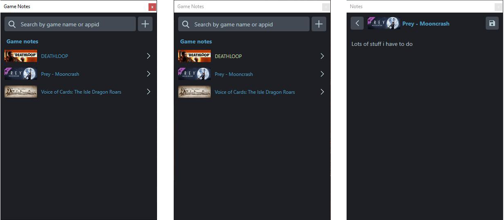
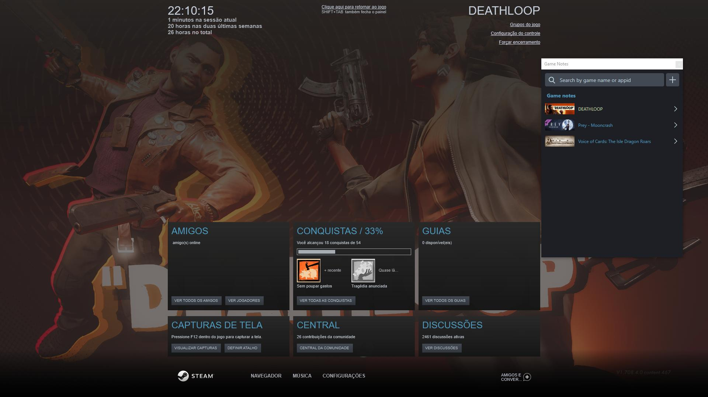

# Steam Game Notes

Keep notes about the games you play.

Simply launch the application and whenever you open Steam's overlay, your notes will be shown.

Requires [.NET Core 3.1](https://dotnet.microsoft.com/download/dotnet/3.1)

